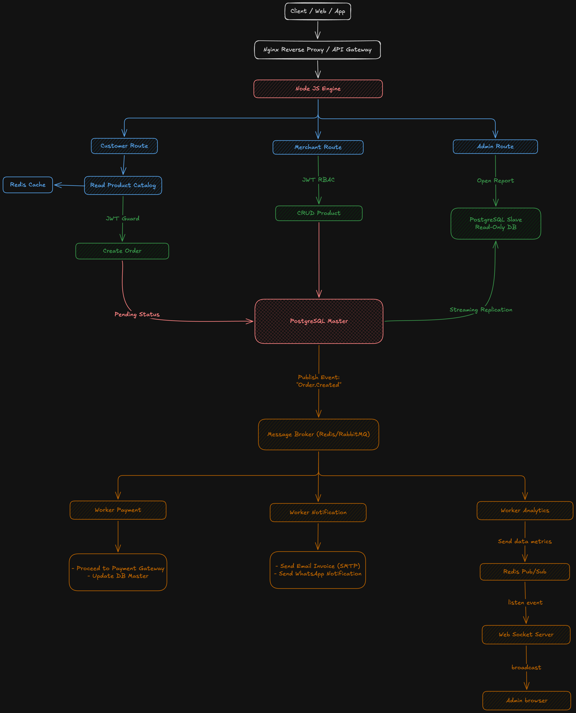

### Arsitektur Backend

Arsitektur yang diajukan menggunakan pendekatan **Decoupled Architecture / Modular Monolith** berbasis Node.js Express untuk memisahkan komponen kritis berbiaya komputasi tinggi menggunakan prinsip *Event-Driven*.

* **API Gateway (Nginx):** Berfungsi sebagai *reverse proxy*, SSL termination, keamanan (*secure headers*), dan penanganan *rate limiting* awal sebelum request menyentuh aplikasi internal.
* **Core API Service (Node.js Express):** Menangani *traffic* sinkron yang membutuhkan respon cepat seperti autentikasi, katalog produk, pencarian, dan pembuatan entri order awal.
* **Database:** Relational Database (PostgreSQL) menggunakan arsitektur *Master-Slave replication* (Master untuk Write transaksi / order, Slave untuk Read dashboard admin).

### Menggunakan Queue / Message Broker

Komponen antrean (*Message Broker*) wajib digunakan untuk memproses komponen-komponen bisnis yang memenuhi kriteria berikut:

1. **I/O Bound & Integrasi Pihak Ketiga:** Proses pengiriman email invoice (via SMTP) dan hit ke API WhatsApp bergantung pada respon vendor eksternal. Dengan melempar proses ini ke antrean secara asinkron, siklus *request-response* pengguna tidak akan tersumbat (*non-blocking*).
2. **Heavy Processing:** Sinkronisasi data aktivitas log serta pembaruan data agregat dashboard admin membutuhkan komputasi intensif yang tidak boleh mengganggu jalannya transaksi utama.
3. **Spike Mitigation (Buffer):** Antrean berfungsi sebagai katup penahan beban (*buffer*) untuk mengamankan database dari kerusakan akibat lonjakan transaksi tiba-tiba (*flash sale*).

### Melakukan Scaling
Beban 10.000 transaksi/hari setara dengan rata-rata ~7 transaksi per menit. Namun, sistem harus didesain untuk menangani *peak hours* (misal: 100-200 *transactions per second* / TPS).
* **Horizontal Scaling:** Menjalankan beberapa *instance* aplikasi Node.js Express di dalam container Docker menggunakan `docker-compose` dengan replikasi, dibantu Nginx sebagai penyeimbang beban (*Load Balancer*).
* **Database Tuning:** Menerapkan *connection pooling* (seperti `pg-pool`) karena arsitektur *single-threaded* Node.js dapat menghabiskan slot koneksi database dengan cepat jika tidak dikelola.
* **Caching:** Memasang Redis di depan database produk untuk menangani *read traffic* massal pada pencarian dan katalog produk.

### Pencegahan Duplicate Event (Idempotency Handling)
Untuk memastikan tidak ada pembayaran ganda atau pengiriman email ganda dari *event* yang sama, diterapkan strategi **Idempotency Key**:
* **Unique Transaction ID:** Setiap order memiliki `order_id` yang unik dari sistem.
* **Idempotency Table / Redis Lock:** Sebelum *worker* memproses tindakan sensitif (seperti memproses pembayaran atau memicu hit ke API WhatsApp), *worker* akan memeriksa status kunci di Redis menggunakan skema `SETNX` (Set if Not Exists) dengan key `lock:order:id_transaksi`.
* Jika key sudah ada, *event* tersebut diabaikan (didrop) karena sedang atau sudah diproses oleh *worker* lain.

### Logging dan Monitoring (Observability)
* **Structured Logging:** Menggunakan library **Pino** atau **Winston** pada Node.js untuk menghasilkan log berformat JSON standar (termasuk korelasi ID transaksi).
* **Metrics Collection:** Memasang **Prometheus** untuk menarik metrik internal aplikasi Express (seperti total request, HTTP 500 error rate, dan durasi query database).
* **Visualization:** Menggunakan **Grafana** yang terhubung ke Prometheus sebagai *datasource* untuk menyajikan visualisasi data *realtime* pada dashboard operasional.
